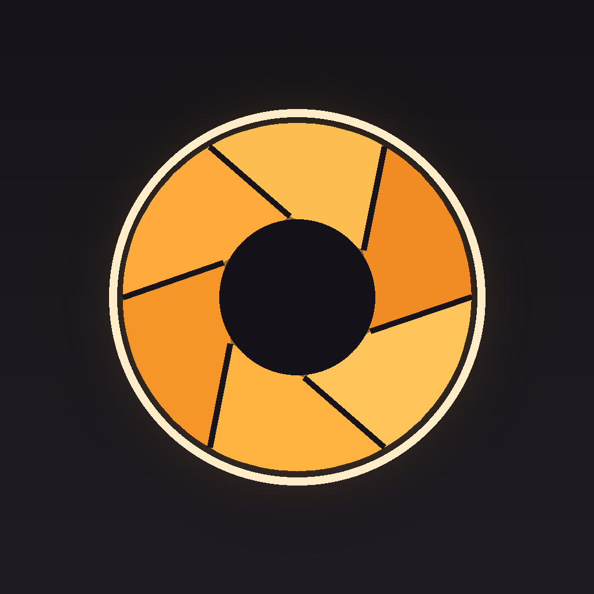
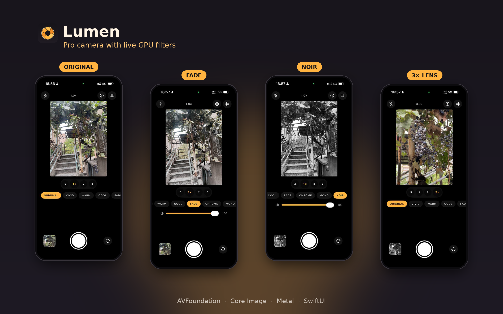
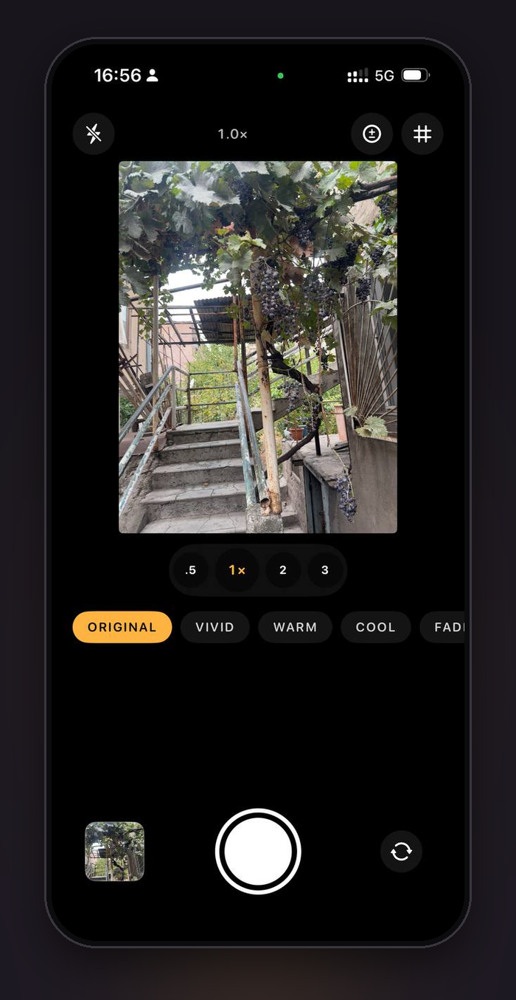
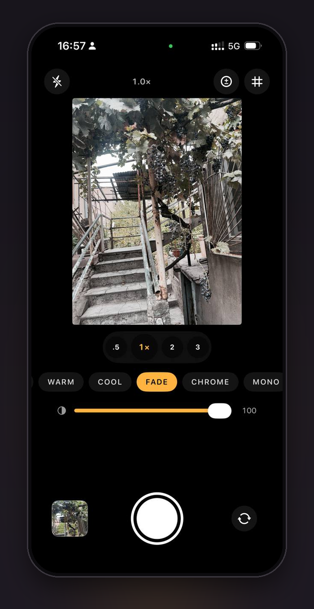
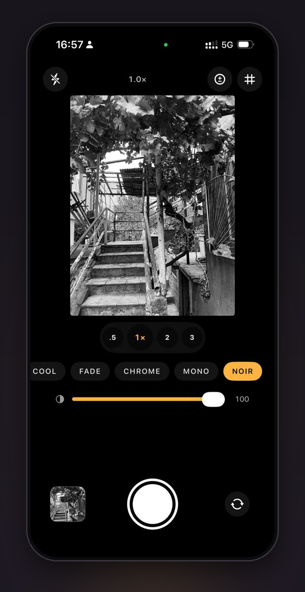
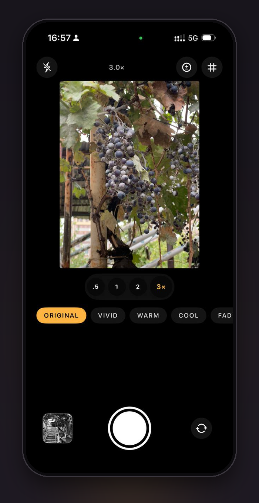
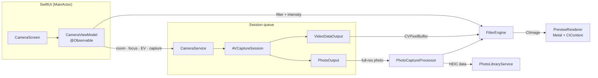

<p align="center">
  
</p>

<h1 align="center">Lumen</h1>

<p align="center">
  A pro camera for iPhone with live, GPU-rendered filters — built from scratch on AVFoundation, Core Image and Metal.
</p>

<p align="center">
  
  
  
  
</p>

---

<p align="center">
  
</p>

## Screenshots

| Original | Fade | Noir | 3× lens |
|:--:|:--:|:--:|:--:|
|  |  |  |  |

<sub>Real screenshots from an iPhone — the filters are rendered live in the viewfinder.</sub>

## Features

- **Custom camera pipeline** — `AVCaptureSession` configured by hand (no `UIImagePickerController`), with the best available lens picked automatically (triple → dual → wide).
- **Live filters at 60 fps** — every frame is filtered with Core Image and drawn into an `MTKView` on the GPU.
- **What you see is what you save** — the preview and the full-resolution photo go through the *same* `FilterEngine`, so captures match the viewfinder exactly.
- **Adjustable intensity** — blend any look from 0–100 %.
- **Lens shortcuts** — 0.5× / 1× / 2× / 3× that map to the real ultra-wide / wide / tele lenses on virtual devices, plus pinch-to-zoom.
- **Tap to focus & expose** with an aspect-fill-aware coordinate conversion.
- **Manual exposure compensation** (EV slider).
- **Flash** off / auto / on, **rule-of-thirds grid**, front/back camera switch.
- **HEIC output** (JPEG fallback) saved to Photos with add-only permission.
- **Polish** — shutter animation, haptics, graceful permission & no-camera states, VoiceOver labels and adjustable actions.

## Architecture



| Layer | Responsibility |
|---|---|
| `CameraService` | Owns the capture session. All configuration runs on a private serial queue; frames arrive on a separate video queue. Exposes an `async` API to the UI. |
| `FilterEngine` / `FilterKind` | Pure, `Sendable` value types. One code path for live frames and stills. |
| `PreviewRenderer` | `MTKViewDelegate` that renders the latest `CIImage` with a Metal-backed `CIContext` and a `CIRenderDestination`. |
| `PhotoCaptureProcessor` | One delegate object per shot; applies the filter at full resolution and encodes HEIC. |
| `CameraMath` | Framework-free geometry (tap → point of interest, clamping) so it can be unit tested without a camera. |
| `CameraViewModel` | `@MainActor @Observable` state for the UI. |

### Design decisions

- **Metal preview instead of `AVCaptureVideoPreviewLayer`** — the preview layer can't show filtered frames. Rendering through Core Image on Metal keeps everything on the GPU with no CPU copies.
- **3:4 viewfinder** — matches the sensor's photo format, so the framing on screen is the framing in the photo.
- **Rotation and mirroring on the connection** (`videoRotationAngle`, `isVideoMirrored`) instead of per-frame transforms, which is cheaper and keeps filters orientation-agnostic.
- **Late frames are dropped** (`alwaysDiscardsLateVideoFrames`) and the renderer only keeps the newest frame, so a slow filter never builds latency.
- **Unfiltered shots keep the original file**, including all EXIF/location metadata.

## Tests

Unit tests cover the parts that don't need camera hardware:

- `FilterEngineTests` — every filter preserves image size, intensity blending and clamping, mono really removes colour.
- `CameraMathTests` — tap-to-focus mapping for back/front cameras and cropped aspect-fill previews, zoom/EV clamping.
- `PreviewRendererTests` — aspect-fill scaling and centring.

CI runs the full suite on every push via GitHub Actions.

## Getting started

Requirements: Xcode 15+, an iPhone on iOS 17+ (the Simulator has no camera).

```bash
brew install xcodegen      # once
git clone https://github.com/Irenapoghosian/lumen-camera.git
cd lumen-camera
xcodegen                   # generates Lumen.xcodeproj
open Lumen.xcodeproj
```

Select your team under *Signing & Capabilities*, then run on a device.

## Roadmap

- [ ] Video recording with filters (AVAssetWriter)
- [ ] ProRAW / RAW capture
- [ ] Manual shutter speed & ISO
- [ ] Custom LUT filters (`CIColorCube`)
- [ ] Before/after split view
- [ ] In-app gallery

## Author

**Irena Poghosyan** — iOS developer · [GitHub](https://github.com/Irenapoghosian)
